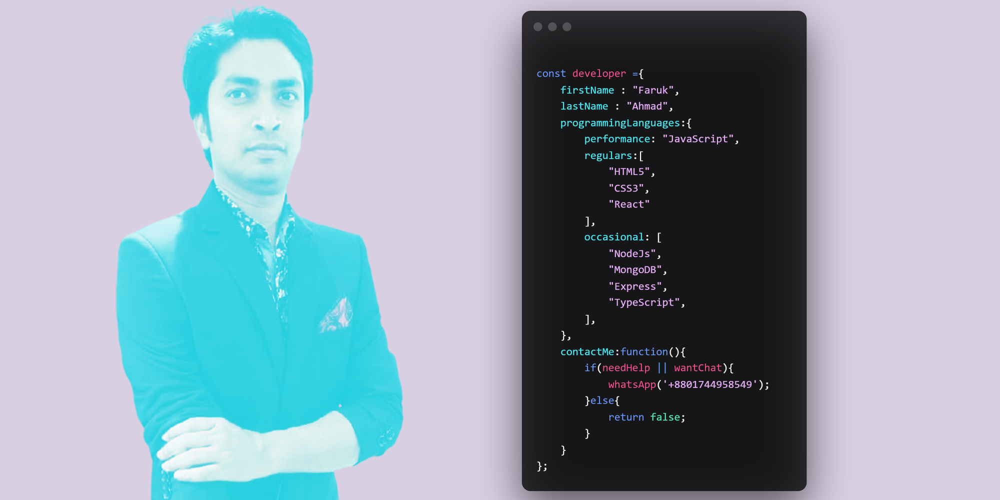

<!--  -->

 # Hi I'm Faruk Ahamd 👋

- 👀 I’m love ...coding
- 🌱 I’m currently Searching Intern -->
- 📫 My Portfolio Link :[Faruk Ahmad](https://farukahmad.netlify.app/)

farukwebcode21/farukwebcode21 is a ✨ special ✨ repository because its `README.md` (this file) appears on your GitHub profile.
You can click the Preview link to take a look at your changes.

<!--  -->

 

# 🚀 Some Projects

Honda CBR 

  
  1. Live Demo: https://cbr300.netlify.app/
  2. Technology: HTML, CSS, Bootstrap
 

 
 

Health Service 

  
  1. Live Demo: https://health-care-5b2d5.web.app/
  2. Technology: HTML, CSS, Bootstrap, React, Firebase, React-Router
 

 
 

Rolex Barand Shop 

  
  1. Live Demo: https://nish-website-9cda1.web.app/
  2. Technology: HTML, CSS, Bootstrap, React, Firebase, React-Router, Node, MongoDB, 
 

 
  

  

Clothing Barand Shop 

  
  1. Live Demo: https://react-firebase-authenatication.web.app/
  2. Technology: HTML, CSS, Bootstrap, React, Firebase, React-Router, Node, MongoDB, 
 

 
  

Book Search 

  
  1. Live Demo: https://sleepy-pike-e1641e.netlify.app/
  2. Technology: HTML, CSS, Javascript
 

 
  

 Shop 

  
  1. Live Demo: https://hardcore-mccarthy-0302e6.netlify.app/
  2. Technology: HTML, CSS, Bootstrap, Javascript
 

 
  

Movie Actors 

  
  1. Live Demo: https://bahabuli-3.netlify.app/
  2. Technology: HTML, CSS, Bootstrap, React, 
 

 
   

Teaching Service 

  
  1. Live Demo: https://dreamy-bardeen-40d165.netlify.app/
  2. Technology: HTML, CSS, Bootstrap, React, 
 

 
  

Travel Agency Service 

  
  1. Live Demo: https://fir-login-e47cc.web.app/
  2. Technology: HTML, CSS, Bootstrap, React, 
 

 
 
  

Free Country API Call 

  
  1. Live Demo:https://country-api-v3.pages.dev/ 
  2. Technology: HTML, CSS, Bootstrap, Javascript, 
 

 
  

MealDB API Call 

  
  1. Live Demo: https://mealdb-tailwindcss.pages.dev/home
  2. Technology: HTML, CSS, Bootstrap, Javascript, 
 

 
  

 Emajon Ecommerce

  
  1. Live Demo: https://emajon-test.pages.dev/
  2. Technology: HTML, CSS, Bootstrap, Javascript, 
 

 
 
  

 Movei Api Call

  
  1. Live Demo: https://farukwebcode21.github.io/movie/index.html
  2. Technology: HTML, CSS, Bootstrap, Javascript, 
 
****

